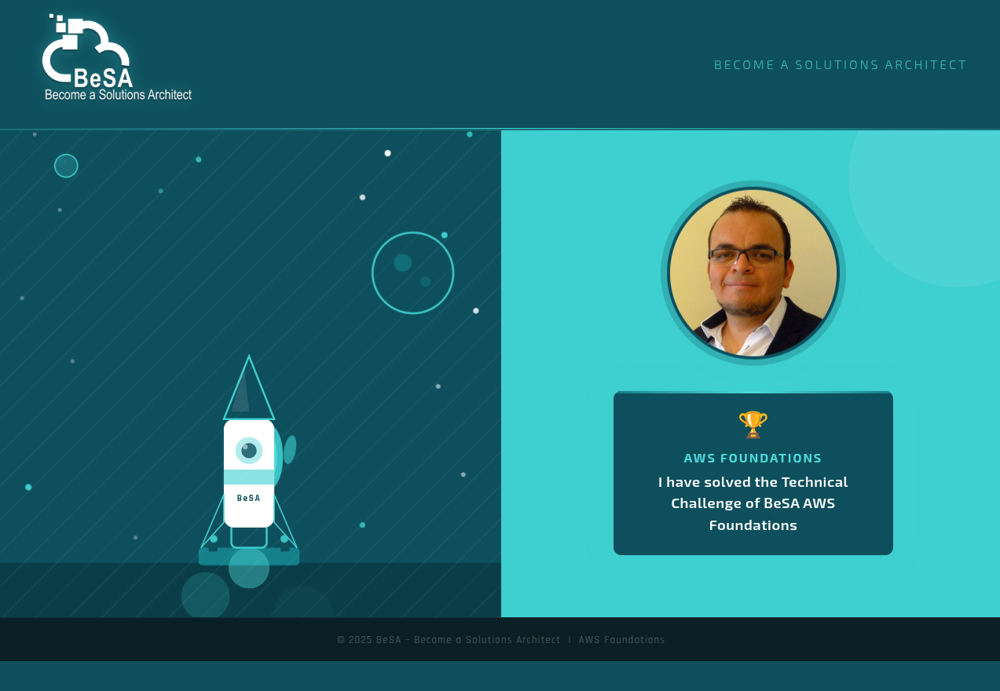

# 🏆 Technical Challenge – BeSA AWS Foundations Series

> **AWS Foundations** · Deploy & Personalise a Web Server on EC2

---

## 📋 Challenge Overview

In this Technical Challenge, you will launch an **Amazon EC2 instance**, configure it as a web server, deploy a provided webpage, and personalise it with your own profile photo 

Upon completing this challenge, you will have demonstrated the ability to:

- Launch and configure an EC2 instance with specific compute and storage requirements
- Install and run a web server
- Clone a GitHub repository onto a remote instance
- Customise and serve a static webpage

---

## 🎯 Objectives

| # | Objective |
|---|-----------|
| 1 | **Install a web server** on your EC2 instance |
| 2 | **Download the webpage code** from this GitHub repository onto the instance |
| 3 | **Update the profile photo** on the webpage with your own photo |
| 4 | Launch the instance using the **T3.Medium** instance type |
| 5 | Configure the **root volume to 20 GB** |

---

## 🖥️ Expected Result

Once the challenge is complete, your webpage should look like this:

The page displays:
- The **BeSA branding** header
- Your **profile photo** in a circular frame
- A **trophy badge** with the text: *"I have solved the Technical Challenge of BeSA AWS Foundations"*

---

  
   
  <strong>© 2025 BeSA – Become a Solutions Architect | AWS Foundations</strong>

