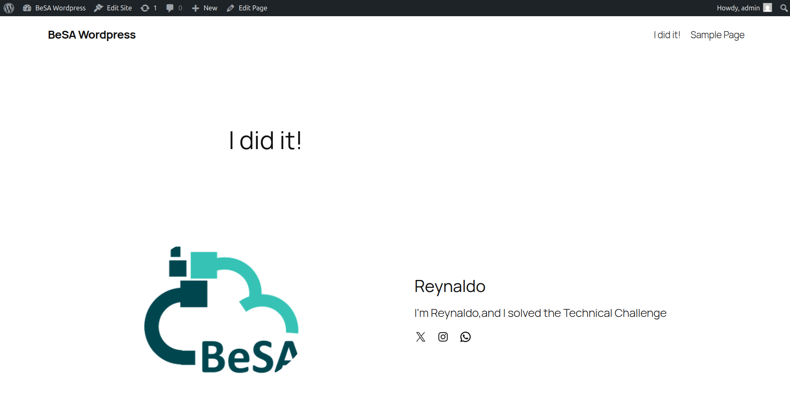
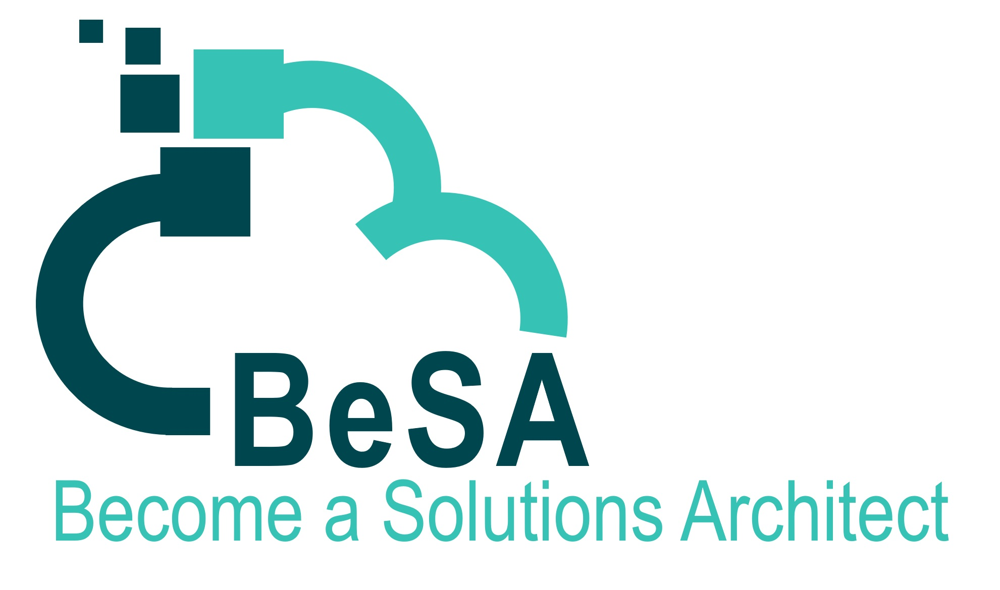

# 🏆 Technical Challenge – BeSA AWS Foundations Series

> **AWS Foundations** · Deploy & Personalise a Web Server on EC2

---

## 📋 Challenge Overview

In this Technical Challenge, you will launch install **Wordpress**, and configure it across at least 2 EC2 instances, once deployed create a post 

Upon completing this challenge, you will have demonstrated the ability to:

- Connect to the EC2 Instance using SSM Session manager 
- Install Apache, PHP and Mysql using a Script
- Install and setup Word press
- Mount an EFS on EC2 instances

---

## 🎯 Objectives

| # | Objective |
|---|-----------|
| 1 | **Install PHP, Apache and MySQL** on your EC2 instance, you can use the script from this GitHub Repo  |
| 2 | **Mount EFS** on the EC2 Instance |
| 3 | **Download and install wordpress** |
| 4 | **Mount EFS** on at least one more EC2 instances |
| 5 | **Create a new post** on Wordpress |

---

## 🖥️ Expected Result

Once the challenge is complete, your webpage should look like this:

The post displays:
- The **BeSA** logo
- Your **name** 

---

  
   
  <strong>© 2026 BeSA – Become a Solutions Architect | AWS Foundations</strong>

