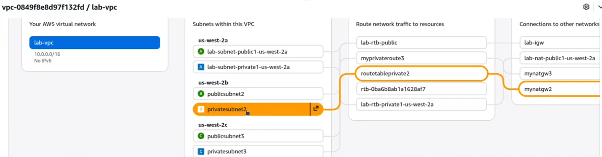
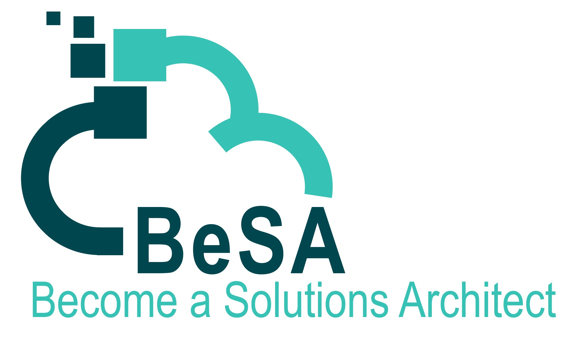

# 🏆 Technical Challenge – BeSA AWS Foundations Series

> **AWS Foundations** · Create a Highly Available VPC

---

## 📋 Challenge Overview

In this Technical Challenge, you will create  a **Highly Available VPC**, 

Upon completing this challenge, you will have demonstrated the ability to:

- Create public and private subnets
- Configure Route tables
- Deploy NAT Gateways across several Availablily Zones

---

## 🎯 Objectives

| # | Objective |
|---|-----------|
| 1 | **Create 2 additional public subnets** on different AZ |
| 2 | **Create 2 additional private subnets** on different AZ |
| 3 | **Configure Route tables** and associate them with the subnets |
| 4 | **Deploy 2 additional NAT Gateways** on different AZ |

---

## 🖥️ Expected Result

Once the challenge is complete, your VPC should look like this:

---

  
   
  <strong>© 2026 BeSA – Become a Solutions Architect | AWS Foundations</strong>

