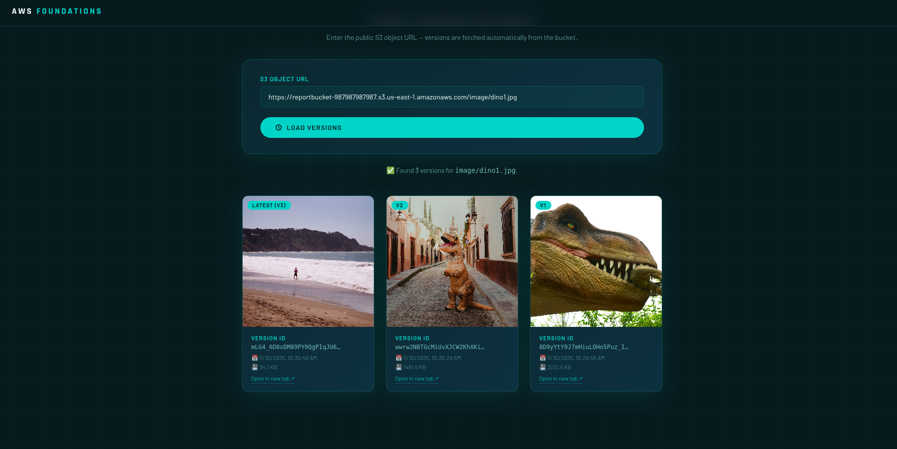

# 🏆 Technical Challenge – BeSA AWS Foundations Series

> **AWS Foundations** · Deploy an Image Version Explorer on S3

---

## 📋 Challenge Overview

In this Technical Challenge, you will create an Image **Version Explorer**, that will be hosted on S3

Upon completing this challenge, you will have demonstrated the ability to:

- Setup S3 Bucket Policy Permissions
- Deploy a static website on S3

---

## 🎯 Objectives

| # | Objective |
|---|-----------|
| 1 | **Configure Bucket Policy** on your S3 Bucket |
| 2 | **Download the webpage code** from this GitHub repository |
| 3 | **Upload** the webpage into S3 |

---

## 🖥️ Expected Result

Once the challenge is complete, your webpage should look like this:

The page displays:
- Your **profile photo** in a circular frame
- All the  **versions** of an Image stored in S3

---

  
   
  <strong>© 2026 BeSA – Become a Solutions Architect | AWS Foundations</strong>

